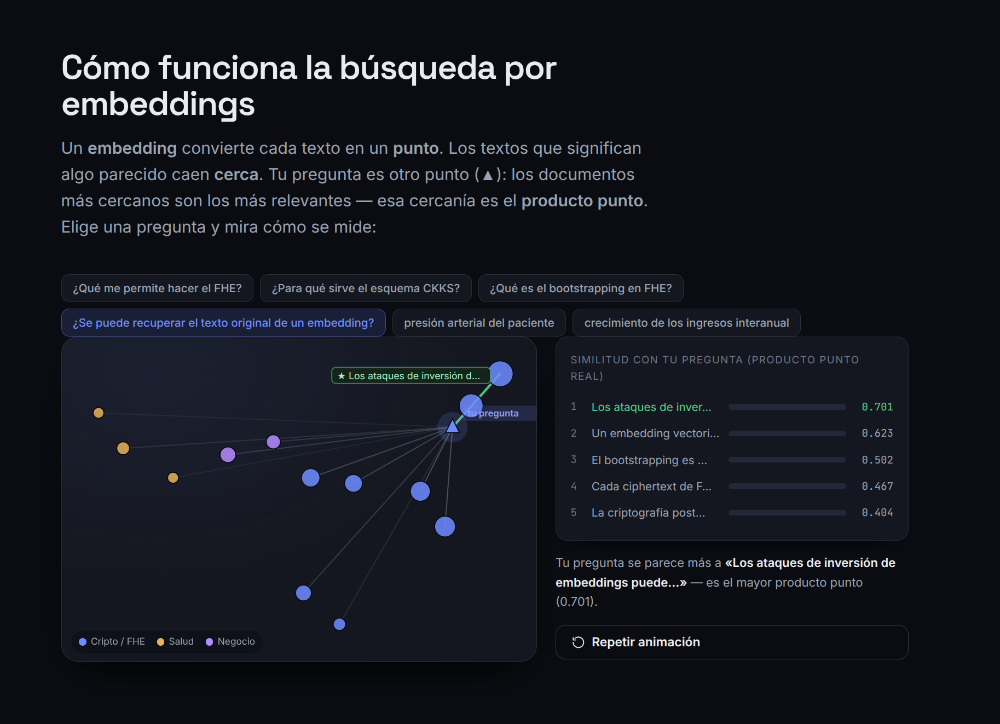
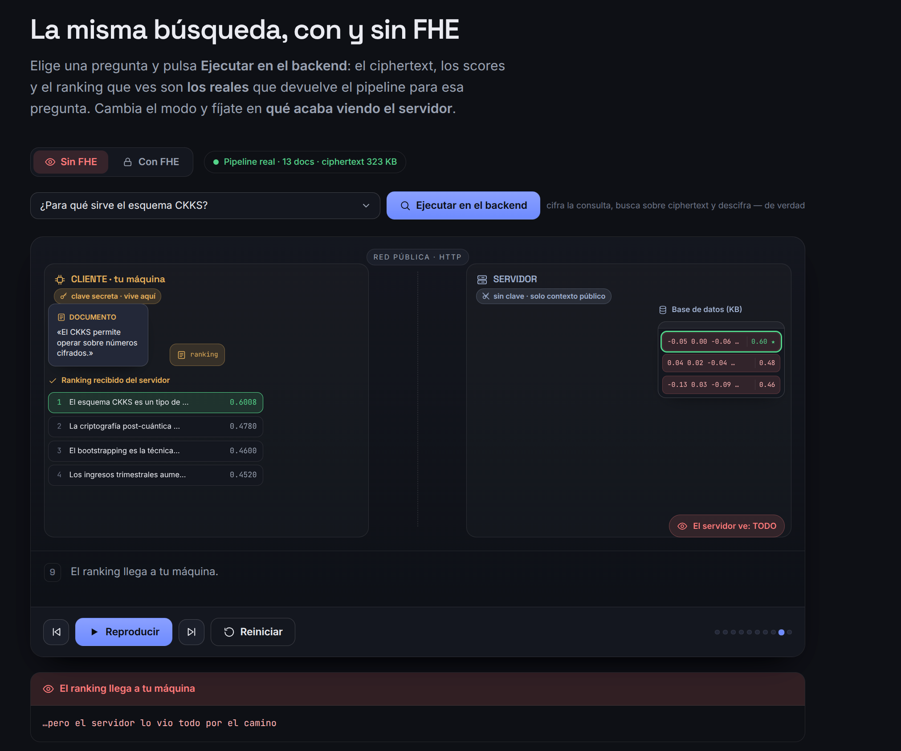
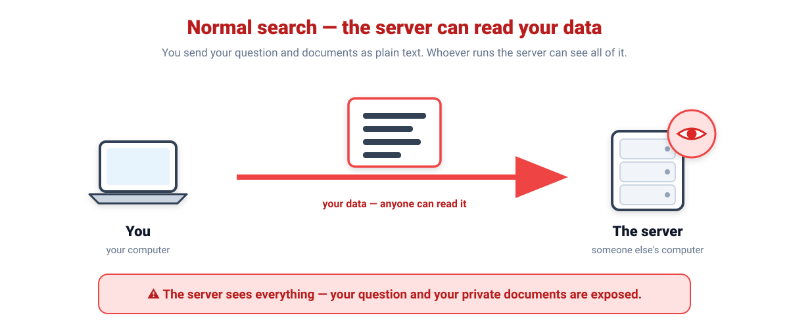
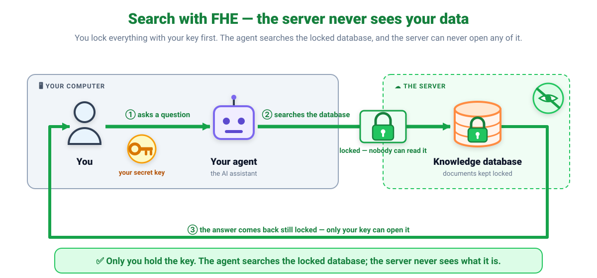
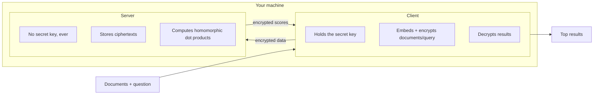

# Privacy-Preserving Vector Search for RAG using FHE

Encrypted similarity search for RAG pipelines. Document embeddings are encrypted client-side using Fully Homomorphic Encryption (CKKS via TenSEAL/Microsoft SEAL). The server performing retrieval never holds the secret key — it computes similarity scores directly on ciphertexts and returns encrypted results only.

**Why this exists:** vector embeddings are commonly assumed to be "safe" to store because they're not human-readable. Research has shown this is false — embedding inversion attacks can reconstruct the original text from stored vectors. This project closes that gap for the retrieval step of a RAG pipeline.

## Where this came from

This project grew directly out of a module of [DataTalks.Club's LLM Zoomcamp](https://github.com/DataTalksClub/llm-zoomcamp) on Vector Search, which teaches the core insight this whole project is built on: once you have a corpus matrix `X` and a query vector `v`, semantic search is just `scores = X.dot(v)`. If vector search really is "just" a dot product, the obvious question is: **what if that dot product happened on encrypted data?** That's what FHE lets you do — and this project is that question, answered.

The embedding model (`shared/embeddings.py`) is also a direct port of the course's ONNX-based `Embedder` class — smaller install, no PyTorch/CUDA, fully offline after a one-time download.

Full design rationale: [`docs/FHE_RAG_Design_Document.md`](docs/FHE_RAG_Design_Document.md)
Agent/contributor guide: [`AGENT.md`](AGENT.md)

## Status — what's actually verified working

✅ Core cryptography layer (CKKS encrypted dot product) — tested, including a test that proves the server's context genuinely cannot decrypt anything.
✅ Local ONNX embedding model — tested, runs fully offline.
✅ Full end-to-end encrypted retrieval, across a 13-document set mixing FHE explainers with unrelated content — tested live, correctly ranks semantically relevant documents above irrelevant ones, entirely on ciphertext.

## Quickstart

```bash
./run.sh
```

That's it — running with no arguments sets up the virtual environment, downloads the embedding model, and runs the educational walkthrough automatically. Re-run it any time; it skips setup/download once they're done and just runs the demo.

`run.sh` is the single entry point for everything in this project — see all commands with `./run.sh help`. No need to manually create or activate a virtualenv.

**If a port is already in use** (e.g. `address already in use` when starting the server), run `./run.sh stop` to kill anything this project left running on its default port (8001). Works even before setup has finished.

## `./run.sh learn` — the educational demo

This is the best way to actually understand what this project does. It runs one real encrypted search and prints **every intermediate value** — not a summary, the actual bytes and numbers — so "the server never sees plaintext" stops being a claim and becomes something you watch happen.

Real output from an actual run:

```
STEP 1 — Turning your document into numbers (plaintext, client-side)
--------------------------------------------------------------------------
Document: "Fully Homomorphic Encryption (FHE) allows computations to be
performed directly on encrypted data, without ever needing to decrypt it
first."

This becomes a numerical fingerprint of its meaning:
  [-0.0287, +0.0709, -0.0408, -0.0077, +0.0137, ... ]  (384 numbers total)

STEP 2 — Encrypting it before it ever leaves your machine
--------------------------------------------------------------------------
Using CKKS homomorphic encryption, this vector becomes:
  0a02800312d1b4145ea1100401020000511a05000000000028b52ffda0610006...  (334,434 bytes total)

Honest trade-off: the plaintext vector is only 3,072 bytes.
Encrypted, it's 334,434 bytes — about 109x larger.
Privacy isn't free; this is the real cost of it.

STEP 5 — The server computes a similarity score — ON the ciphertext
--------------------------------------------------------------------------
Server runs:  encrypted_query.dot(encrypted_document)
The server's own output is STILL encrypted:
  0a010112deae0e5ea11004010200005e9703000000000028...  (235,374 bytes total)

STEP 6 — Only you can decrypt the result
--------------------------------------------------------------------------
  Decrypted similarity score: 0.5074

Sanity check — does this match the same math done in plaintext?
  Plaintext dot product (reference only): 0.5074
  Difference: 0.00000518  (tiny CKKS approximation noise, expected)
```

Full output has 6 steps, color-coded in your terminal: yellow for the plaintext data that's only ever visible to you, gray for ciphertext, red for what the server would see if it tried to read any of it, green for what's safe.

## `./run.sh ui` — the animated web explainer (for talks)

A web app built for **explaining this to an audience** — and it runs on the **real pipeline**, not mock data. `web/app.py` starts the real ciphertext-only server, generates the key, encrypts and indexes the real document embeddings, and serves the page; the frontend animates the actual values it gets back: real embeddings, real ciphertext and its real size (~100×), real encrypted scores, and the real decrypted ranking.

```bash
./run.sh ui                  # serves http://127.0.0.1:8080 (auto-picks a free port)
```

First load takes a few seconds while it encrypts + indexes. What's inside:

- **How embedding search works** — the real 13 embeddings projected to 2D (real PCA), with a query point and the **real dot-product** ranking. Pick a query and watch the nearest documents light up.

  

- **Animated comparison** — a `Sin FHE ⟷ Con FHE` toggle over the same client/server stage, driven by a real search you can type yourself ("Ejecutar en el backend"). Play/pause/step controls; you see the response travel back, the client **decrypt** it, and the **real ranking** with the chosen document. A persistent "what the server can read" panel turns red (without FHE) or green (with FHE). Deep-linkable for a talk: `?mode=fhe&step=7`.

  
- **Theory · without FHE / with FHE** — how each is done and why it matters (embedding inversion; why CKKS).
- **Cliente vs Servidor** — an explicit matrix of what each side holds and stores.

The security invariant holds here too: `web/app.py` runs the client (secret key) and talks to the real server over HTTP; the server never receives the key and never decrypts. The API only exposes client-side-legitimate values (embeddings, ciphertext, encrypted scores, decrypted ranking).

## Other ways to run it

```bash
./run.sh demo               # one command, starts its own server, prints final results
./run.sh server              # terminal 1 — start the server
./run.sh client               # terminal 2 — interactive client against it
```

`client_cli.py` (run via `./run.sh client`) is the cleanest way to see Client and Server as genuinely separate processes communicating over HTTP — the way they'd run on two different machines in a real deployment.

## The idea in two pictures

**Normal search:** you send your question and documents to a server as plain text, so whoever runs that server can read all of it.



**Search with FHE:** you lock your data with your own key first. The server does the exact same search on the locked box and never opens it — only you can.



## How this works, in one picture



**The only thing that crosses the boundary between Client and Server is ciphertext.** See `AGENT.md` for the full security invariant.

## Architecture

```
client/               -> Holds the secret key. Embeds, encrypts, decrypts, ranks.
server/               -> Holds only the public context. Stores ciphertexts,
                         computes homomorphic dot products. Never decrypts.
shared/               -> Local ONNX embedding model, config, and the shared
                         sample document set used across all the demos.
run.sh                -> Single entry point: setup, test, server, client, demo, learn, stop.
stop.sh               -> Kills anything left running on the default port.
client_cli.py         -> Interactive client REPL (used by `run.sh client`).
educational_demo.py   -> Step-by-step walkthrough with real data (used by `run.sh learn`).
demo.py               -> One-command end-to-end demo (used by `run.sh demo`).
```

## Sample documents

`shared/sample_documents.py` has 13 documents: 8 explaining real FHE/cryptography concepts (what FHE is, what CKKS is, noise growth, bootstrapping, embedding inversion attacks), and 5 unrelated business/health documents, on purpose — so a query like *"What does FHE actually let you do?"* demonstrably ranks the right documents above irrelevant ones, on ciphertext, not just in theory.

## Why CKKS (TenSEAL/SEAL) instead of Zama/TFHE

CKKS natively supports SIMD-packed real-valued vector arithmetic, which is exactly what embedding dot products need. TFHE/Concrete is built around encrypted-input-times-clear-model (private inference with a public model) and integer arithmetic — a different threat model and data type than ours, where both the query and the stored documents need to stay encrypted. Full reasoning in the design document.

## Known limitations

- No efficient encrypted approximate-nearest-neighbor search exists yet — this performs homomorphic brute-force comparison against every stored vector. Fine for hundreds-to-low-thousands of documents; an open research problem at larger scale.
- CKKS is approximate arithmetic — expect tiny numerical error (~1e-6) on decrypted scores.
- Ciphertext is roughly 100x larger than the equivalent plaintext vector, and the one-time public context is large (~35MB) because it includes the Galois keys needed for encrypted dot products. Both are real, measured costs, not estimates — see `./run.sh learn`.
- This protects the retrieval step only, not LLM inference itself.

## Credits

Built on top of [DataTalks.Club's LLM Zoomcamp](https://github.com/DataTalksClub/llm-zoomcamp), Module 2 (Vector Search).

## License

MIT
