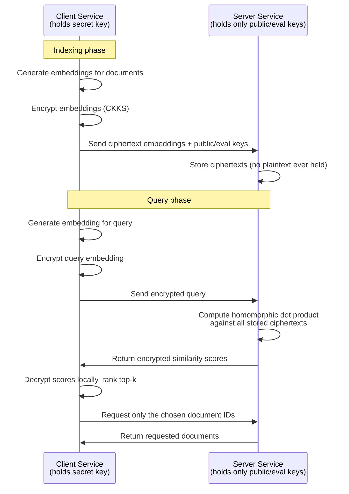

# Privacy-Preserving Vector Search for RAG using FHE
### Project Design Document

**Author:** Raúl Giménez Lorente
**Status:** Design phase
**Last updated:** June 2026

---

## 1. One-Line Pitch

A drop-in component for RAG pipelines that performs similarity search directly on **encrypted** document embeddings, so the server doing retrieval never sees plaintext vectors — closing a real, documented privacy gap in how modern AI systems store and search sensitive data.

---

## 2. The Problem

Retrieval-Augmented Generation (RAG) has become the standard way to connect LLMs to private or proprietary data. The typical pipeline looks like this:

1. Documents are converted into vector embeddings (numerical representations of meaning).
2. Embeddings are stored in a vector database.
3. At query time, the query is also embedded, and the database returns the most similar stored vectors.
4. The corresponding text is retrieved and handed to the LLM as context.

**The assumption almost everyone makes:** embeddings are just numbers, not human-readable text, so storing them is "safe enough" even for sensitive data.

**This assumption is false.** Research has demonstrated *embedding inversion attacks*, where an attacker with access to a vector database can reconstruct the original sentence — sometimes including sensitive personal or proprietary information — directly from the embedding itself. In other words, the embeddings are not the anonymized, harmless artifacts they're often treated as.

This matters because:

- A growing share of employee interactions with AI tools involve sensitive data (rising sharply year over year as enterprise AI adoption accelerates).
- The majority of enterprise AI traffic flows to external, third-party tools and infrastructure.
- RAG pipelines are increasingly flagged as the weakest security link in enterprise AI deployments, precisely because the vector store is treated as a low-risk component when it isn't.
- High-profile incidents (e.g., employees pasting proprietary source code into public LLM tools) show this isn't a hypothetical risk — it's an active, ongoing one.

Existing mitigations — access control, encryption at rest, redaction before embedding — protect the data *around* the vector store, but none of them protect the **mathematical content of the embeddings themselves** while they're actually being searched. If the vector database is breached, or if the search infrastructure itself is compromised or operated by a third party, the embeddings are exposed in plaintext at the exact moment they're most useful to an attacker.

---

## 3. The Solution — High-Level Approach

Encrypt the embeddings **before** they ever leave the client, using Fully Homomorphic Encryption (FHE). Perform the similarity search — the mathematical operation that finds the closest matching documents — **homomorphically**, directly on the ciphertexts. The server performing the search never has the secret key and never sees plaintext vectors, plaintext similarity scores, or plaintext documents.

This is the same core principle as the bachelor thesis project this builds on (an FHE-based secure HR data system): **the party doing the computation should never be the party that can read the data.**

### What changes vs. a normal RAG pipeline

| Step | Normal RAG | This project |
|---|---|---|
| Embedding generation | Plaintext vector | Plaintext vector, encrypted immediately after generation, client-side |
| Storage | Plaintext vector in DB | Ciphertext only — server never holds a decryptable vector |
| Similarity search | Plaintext dot product / cosine similarity | Homomorphic dot product computed directly on ciphertexts |
| Result returned to client | Top-k documents | Encrypted similarity scores — client decrypts locally to determine top-k |
| Document retrieval | Direct from DB | Only requested after client has decrypted and chosen the relevant document IDs |

---

## 4. Architecture

**Key security property:** at no point does the Server process ever possess the secret key, a decrypted vector, or a decrypted similarity score. A full compromise of the Server reveals nothing usable — only ciphertext.

---

## 5. Tech Stack

| Layer | Technology | Rationale |
|---|---|---|
| FHE engine | TenSEAL (Microsoft SEAL, CKKS scheme) | Production-grade, supports vectorized encrypted operations and dot products natively; direct continuation of bachelor thesis expertise |
| Embedding model | sentence-transformers (`all-MiniLM-L6-v2`) | Lightweight, fast, no GPU required, good semantic quality for demo scale |
| Client & Server services | Python 3.11, FastAPI | Clean separation of trust boundaries as two independent services |
| Ciphertext storage | SQLite | Sufficient for demo scale; avoids overstating scope with a full vector DB |
| RAG framework integration | Custom LangChain `BaseRetriever` subclass | Demonstrates real-world drop-in usability, not just a standalone script |
| Demo interface | Streamlit | Fast to build; supports side-by-side encrypted vs. plaintext comparison |
| Benchmarking | matplotlib / plotly | Visualizes the latency trade-off honestly |
| Deployment | Hugging Face Spaces | Free, public, portfolio-visible |
| Version control | GitHub (public repo, MIT license) | Discoverability for recruiters and the FHE/privacy community |

---

## 6. Known Limitations & Honest Trade-offs

This project is deliberately scoped to be **technically real, not oversold**. Important limitations to be transparent about, including in any public write-up:

- **No efficient encrypted approximate nearest-neighbor (ANN) search.** Plaintext vector databases use indexing structures (e.g., HNSW) for fast search at scale. No efficient equivalent exists yet for FHE — this project performs a homomorphic brute-force comparison against every stored vector. This is acceptable and demonstrable at hundreds to low thousands of documents, but does not scale to millions without further research (this is an open problem in the field, not a gap unique to this project).
- **CKKS is approximate arithmetic.** Results carry a small numerical error from encryption noise. Parameters must be sized carefully — this is a direct application of noise-budget management from the bachelor thesis.
- **Latency is meaningfully higher than plaintext search.** The project will measure and openly report this cost rather than hide it. The pitch is about closing a real security gap, not claiming FHE is free.
- **This protects the retrieval step only**, not the LLM inference itself. Encrypting full LLM inference is not currently practical for a project of this scope (or arguably, for anyone outside well-funded FHE research labs).

---

## 7. Scope

### MVP (what gets built first)
- Working Client/Server split with TenSEAL-based encrypted dot product search
- LangChain retriever integration
- Streamlit demo: upload documents → encrypted indexing → ask a question → encrypted retrieval → decrypted answer
- Latency benchmark: plaintext search vs. homomorphic search, displayed as a chart

### Stretch goals (if time allows)
- Comparison against Zama's TFHE-rs as an alternative backend, benchmarked against TenSEAL/SEAL
- Support for a second embedding model to test parameter sensitivity
- Basic encrypted approximate filtering (e.g., clustering ciphertexts) to partially address the ANN scaling limitation

---

## 8. Success Criteria

The project is considered successful if it can:

1. Demonstrably answer a natural-language question correctly using only homomorphically retrieved context.
2. Prove — through architecture, not just claims — that the Server process never has access to a decryptable vector at any point.
3. Produce an honest, published latency comparison against plaintext retrieval.
4. Be usable by someone else via the LangChain retriever interface with minimal integration effort.
5. Be deployed publicly (Hugging Face Spaces) with a clear, well-documented GitHub repository.

---

## 9. Why This Project Matters (Positioning)

This project sits at a genuine, current intersection: applied cryptography expertise (FHE, CKKS) combined with practical AI engineering (RAG, embeddings, LLM integration), aimed at a real and growing problem (sensitive data exposure in enterprise AI systems). It is a direct technical extension of prior bachelor thesis work — the same core security principle (the computing party should never be the party that can decrypt) applied to a 2026-relevant problem instead of a 2023 HR records system.
